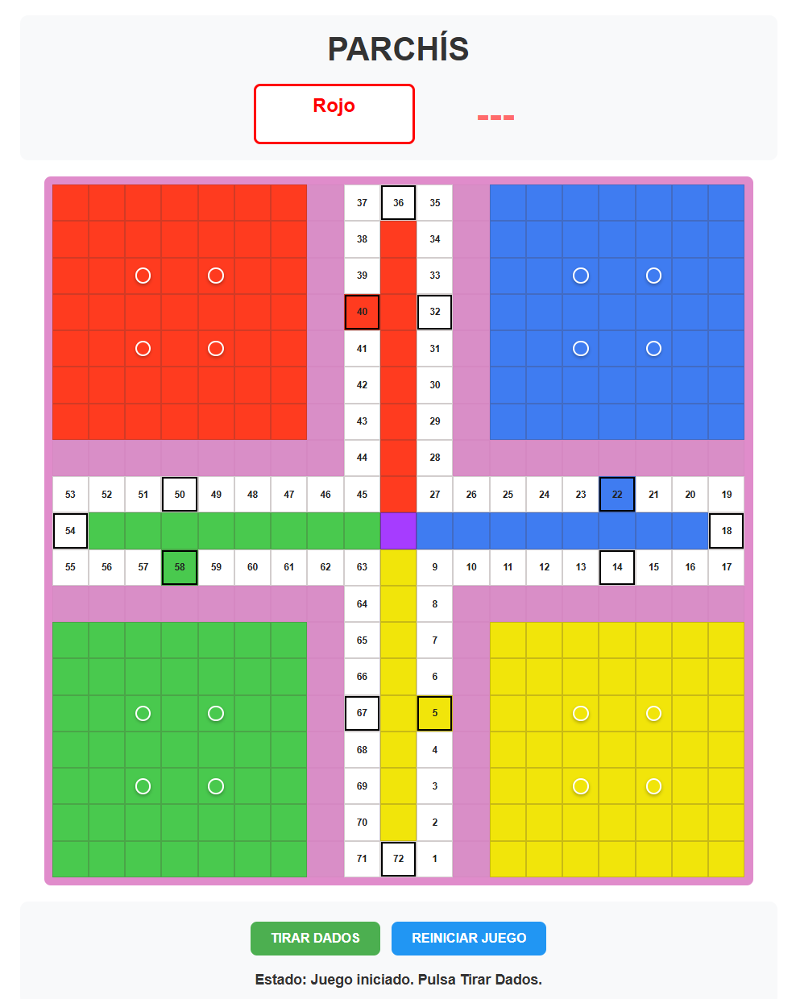

# !!STILL IN PROCESS!!
# Project made to learn JavaScript

# Parchís Web

A browser-based Parchís game built with HTML, CSS, and vanilla JavaScript. The board is generated dynamically in the browser and the game includes four players, dice turns, kills, safe cells, bridges, and a reset flow.

## Features

- 19x19 board rendered with JavaScript
- 4-player local match: red, green, yellow, and blue
- Dice-based turns with turn status shown on screen
- Piece spawning from home when a player rolls a 5
- Capture logic for enemy pieces on the starting cell and on the board
- Safe cells and bridge rules
- Special turn effects such as rolling three 6s, forced bridge opening, and extra movement after a killing
- Game reset button to restart the match

## Project Structure

- `index.html` - Main page and UI layout
- `css/style.css` - Game styling and board layout
- `js/game.js` - Main game controller and turn logic
- `js/board.js` - Board generation and rendering
- `js/player.js` - Player model
- `js/piece.js` - Piece model and movement state
- `js/cell.js` - Cell model
- `js/animations.js` - Movement and highlight animations
- `js/movement.js` - Alternative movement helpers, currently commented out (STILL IN PROGRESS)

## How It Works

The game starts by creating the board, placing each player’s four pieces in their home area, and waiting for the first dice roll. From there, the current player can roll the dice, select a movable piece, and continue following the rules implemented in the controller.

Main rules currently handled in the code:

- Rolling a 5 can bring a piece out of home if the starting cell allows it
- Rolling a 6 lets the player roll again after moving
- Three consecutive 6s trigger a penalty that sends one piece home
- Pieces cannot pass through bridges
- Two pieces of the same player on the same track cell form a bridge
- Landing on an enemy piece can send it home unless the cell is safe
- Killing an enemy grants an extra 20-cell move opportunity
- When a piece is on the final cells line, three consecutive 6s penalty dont affect.
- If a piece gets to the final cell, u get an advantage of 10-cell move.
- You win the game if u ge all your 4 pieces into the final cell.

## Running Locally

This project has no build step or external dependencies. Open `index.html` directly in a browser, or serve the folder with any simple static server.

## Screenshots

## FUTURE IMPLEMENTATIONS AND IMPROVEMENTS

- Better organization of the diferent methods from `js/game.js`. Divide into different functions. 
- online implementation? (IT WOULD BE SO NICE)
- Better visual design of the game. (Maybe an dice animation?)
- Maybe change the UI to English or add a feature to choose the lenguage u want (english or spanish)

## License

No license file is included yet.
